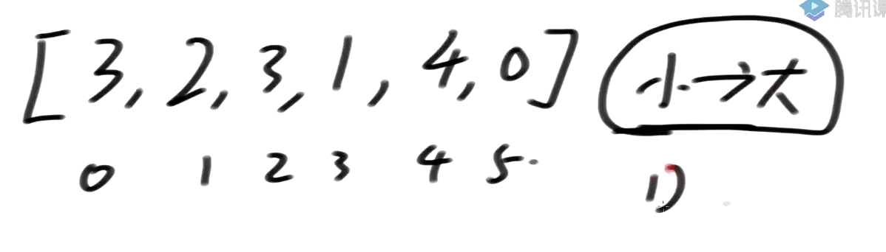
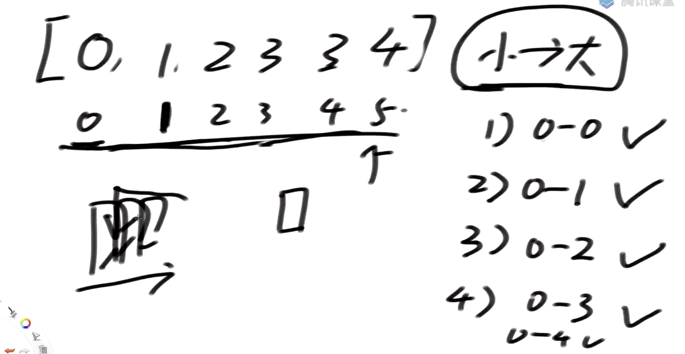

# 第一节

> 左程云算法与数据结构课 https://www.bilibili.com/video/BV13g41157hK?p=2&spm_id_from=pageDriver

常数时间操作

## 评价指标

> 时间复杂度（最差情况下N的最高阶）
>
> 空间复杂度


## 冒泡

谁大谁往右，即便数据优良，也省不了所有的操作。

# 插入排序

理解为排好序的牌，然后重新摸到了一张牌，把它从头到尾比一下，放入到对应的位置






J+1 永远是眼睛盯着的位置，J 永远是左边的位置


## 脉络

知道怎么算的算法

知道怎么试的算法


## 认识对数器

> 概念

1. 有一个想要测的方法
2. 实现复杂度不好但是容易实现的方法b
3. 实现一个随机样本产生器
4. 把方法a和方法b跑相同的随机样本，看看得到的结果是否一样
5. 如果有一个随机样本使得比对结果不一致，打印样本进行人工干预，改对方法a或者方法b
6. 当样本数量很多时比对测试依然正确，可以确定方法a已经正确

> 场景

用两种方法排序，然后把不一样的结果打出来。这样就选出来不一致的部分，再进行算法调整

> 代码

 我想验证冒泡对不对，我生成一些随机数用 *Arrays.sort(arr)*   排完的结果来比较，不一致的打印出来再调整。

```java
public class ComparatorTest {
    //冒泡排序 方法a
    public static void bubbleSort(int[] arr) {
        if (arr == null || arr.length < 2) {
            return;
        }
        for (int end = arr.length-1; end > 0; end--) {
            for (int i = 0; i < end; i++) {
                if (arr[i] > arr[i+1]) {
                    swap(arr,i,i+1);
                }
            }
        }
    }
    public static void swap(int[] arr, int i, int j) {
        arr[i] = arr[i] + arr[j];
        arr[j] = arr[i] -arr[j];
        arr[i] = arr[i] - arr[j];
    }

    //for test
    public static void comparator(int[] arr) {
        //方法b
        Arrays.sort(arr);
    }

    //for test
    //生成随机数组
    public static int[] generateRandomArray(int maxSize, int maxValue) {
        int[] arr = new int[(int) ((maxSize + 1) * Math.random())]; //长度随机
        for (int i = 0; i < arr.length; i++) {
            //值随机
            arr[i] = (int) ((maxValue + 1) * Math.random()) - (int) (maxValue * Math.random());
        }
        return arr;
    }

    //for test
    //复制数组
    public static int[] copyArray(int[] arr) {
        if (arr == null) {
            return null;
        }
        int[] res = new int[arr.length];
        for (int i = 0; i < arr.length; i++) {
            res[i] = arr[i];
        }
        return res;
    }

    //比较两数组是否相同
    public static boolean isEqual(int[] arr1, int[] arr2) {
        if (arr1 == null && arr2 == null) {
            return true;
        }
        if (arr1 == null || arr2 == null) {
            return false;
        }
        if (arr1.length != arr2.length) {
            return false;
        }
        for (int i = 0; i < arr1.length; i++) {
            if (arr1[i] != arr2[i]) {
                return false;
            }
        }
        return true;
    }

    //打印数组
    public static void printArray(int[] arr) {
        if (arr == null) {
            return;
        }
        for (int i = 0; i < arr.length; i++) {
            System.out.print(arr[i] + " ");
        }
        System.out.println();
    }

    //for test
    public static void main(String[] args) {
        int testTime = 500000;   //测试次数
        int maxSize = 100;       //最大测试容量
        int maxValue = 100;      //最大测试数据
        boolean succeed = true;  //是否对比成功
        //开始测试
        for (int i = 0; i < testTime; i++) {
            int[] arr1 = generateRandomArray(maxSize, maxValue);
            int[] arr2 = copyArray(arr1);
            bubbleSort(arr1);
            comparator(arr2);
            if (!isEqual(arr1, arr2)) {
                succeed = false;
                break;
            }
        }

        System.out.println(succeed ? "Nice" : "Bad");
        int[] arr = generateRandomArray(maxSize, maxValue);

        printArray(arr); //没排序打印
        bubbleSort(arr); //排序
        printArray(arr); //排序完打印，程序员自己观察是否正确
    }
}
```

## 认识二分法

经典的场景，有序数组中找某个数是否存在。

## 

Mid =L+ (R-L)>>1


